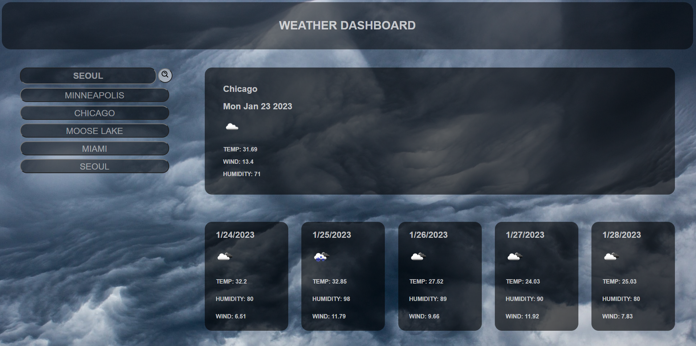

# Weather-Dashboard

## Description
This website is a weather dashboard that will give you the current temperature and weather conditions along with a five day forcast so you can prepare for the week.
It uses local storage to save your recent searches so you can easily switch between viewing the weather of different cities.
During this project I furthered my knowledge about using local storage, I also learned how to use tamplate literals to create elements on a page.
This was also my first time using an API in a website so I learned how to call from an API and use the information it passes back on a webpage.

## Installation

There is no intallation required for this prject. Just go to the website and type a city in the searchbar.

## Usage

Start using the application by searching for a city. It will be added to the recent search tab on the side of the page. The current information as well as the five day forecast will appear on the page. From there you can search for other cities. At any time click on one of the recent cities buttons to view the information from that city.

## Credits

--Sam Barsuhn

-- U of M Coding Bootcamp

## License

MIT license
